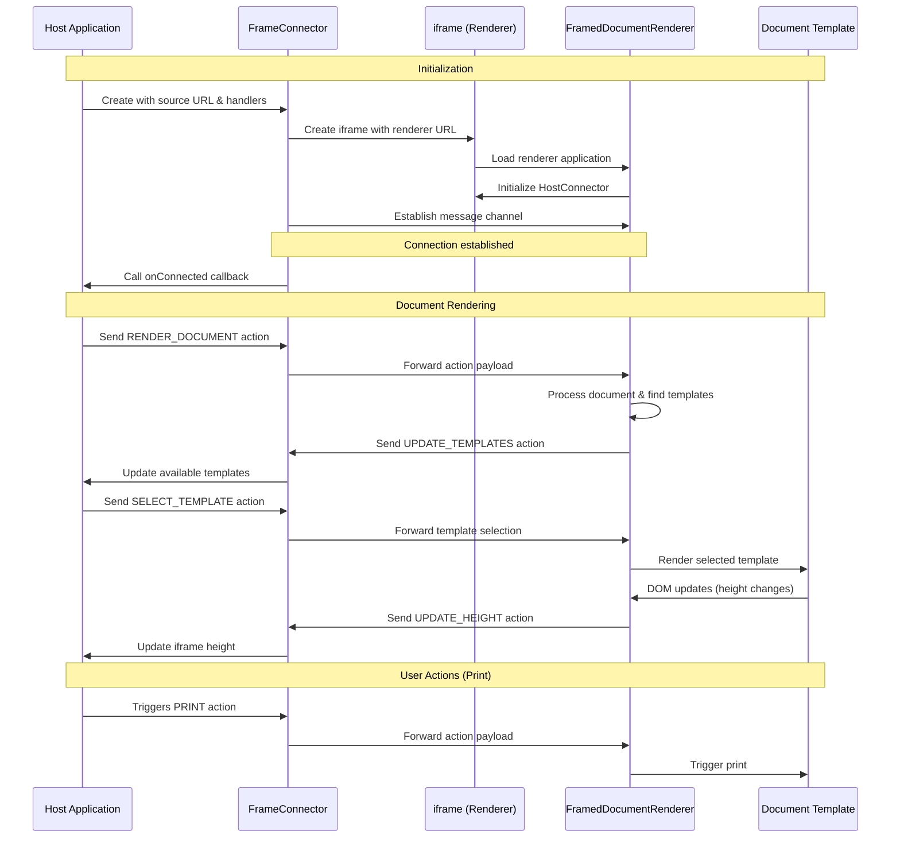

# Decentralized Renderer Guide

This comprehensive guide covers best practices and troubleshooting for TradeTrust decentralized renderers, helping you build robust, maintainable, and user-friendly document templates.

## Introduction

Decentralized renderers are essential components in the TradeTrust ecosystem that provide document preview templates. They allow issuers to define how their documents are displayed while keeping the rendering logic separate from the verification process.

### Key Concepts

- **Decentralized Renderer**: A web application that provides document preview templates
- **Document Schema**: The data structure of your TradeTrust document
- **Template**: A React component that renders a specific document type
- **Template Registry**: A mapping between document types and their template components

## Architecture and Communication Flow

Decentralized renderers are designed to run in a sandboxed iframe, isolated from the main application. This architecture provides security while allowing documents to be rendered with custom templates. The communication between the host application and the decentralized renderer happens through a well-defined message passing interface.

### Components Overview

1. Host Application Side
   - **FrameConnector**: Creates an iframe that loads the decentralized renderer and establishes a communication channel
   - Manages the lifecycle of the renderer, including fallback scenarios
2. Renderer Side
   - **FramedDocumentRenderer**: Sets up a message listener to receive actions from the host
   - Manages template selection and rendering within the iframe
   - Sends updates (height changes, available templates) back to the host

### Communication Flow

The diagram below illustrates the communication between the host application and the decentralized renderer:



### How It Works

#### 1.&nbsp; Initialization:

- The host application creates a `FrameConnector` component with the URL of the decentralized renderer
- `FrameConnector` creates an iframe pointing to that URL
- The renderer loads and initializes the `FramedDocumentRenderer` component
- A message channel is established between the two sides

#### 2.&nbsp; Document Rendering:

- The host sends a `RENDER_DOCUMENT` action with the document data
- The renderer processes the document and finds applicable templates
- The renderer sends back an `UPDATE_TEMPLATES` action with available templates
- The host can select a template by sending a `SELECT_TEMPLATE` action
- The renderer renders the selected template

#### 3.&nbsp; Ongoing Communication:

- The renderer sends `UPDATE_HEIGHT` actions when content size changes
- The host can trigger printing via a `PRINT` action

#### 4.&nbsp; Error Handling:

- If the renderer fails to load, a fallback renderer can be used
- Error boundaries in the renderer catch and display template errors

This architecture ensures that:

- Documents can be securely rendered in isolation
- The host application maintains control over the rendering process
- Custom templates can be used without compromising security
- The renderer can be hosted separately from the verification application

## Operational Considerations

### External Usage

**Remember that your renderer might be used by external systems you don't control.**

Your decentralized renderer will be embedded in various applications, including the TradeTrust document viewer, third-party applications, and other verification portals. This means:

- Don't rely on specific parent application behaviors
- Avoid assumptions about the environment where your renderer will run
- Design your renderer to be self-contained and autonomous

### Perpetual Availability

**Templates must remain available indefinitely.**

Since TradeTrust documents may not expire and could be verified years after issuance:

- Never remove templates from your decentralized renderer
- Maintain consistent URLs for your renderer service
- If you must migrate to a new domain, implement permanent redirects
- Consider archiving old templates in publicly accessible repositories

## Environment Setup & Requirements

### CORS Configuration

Decentralized renderers must support Cross-Origin Resource Sharing (CORS) to function properly with TradeTrust applications.

**Best Practice**:

- Enable CORS for all routes in your renderer
- Allow all origins (`Access-Control-Allow-Origin: *`)
- Support HEAD, GET, and POST methods

### High Availability

Your decentralized renderer must be highly available to ensure documents can be viewed at any time.

**Best Practice**:

- Deploy to a reliable hosting service
- Implement monitoring and alerting
- Use CDN for static assets
- Set up automated deployment pipelines

**Troubleshooting**:
If your renderer is unavailable, documents will display with fallback UI. Ensure proper health checks are in place to detect and respond to outages quickly.

### Fallback UI

Always provide a fallback UI in case your renderer fails or is unavailable.

**Best Practice**:

- Implement error boundaries in React components
- Design a graceful fallback experience
- Provide useful error information when possible

#### 1.&nbsp; Applications embedding third party renderers should implement fallback mechanisms:

When integrating with decentralized renderers, always use the `useFallbackRenderer` prop to gracefully handle renderer failures:

```tsx
<FrameConnector
  source={source}
  dispatch={fromFrame}
  onConnected={fn}
  className={`w-full ${height !== 0 ? "border" : ""}`}
  style={{ height: `${height}px` }}
  useFallbackRenderer={true}
/>
```

The `useFallbackRenderer` prop ensures that if the third-party renderer fails to load (4xx, 5xx), the application will display a fallback UI instead of breaking completely. This creates a more resilient user experience when dealing with external dependencies. The system automatically falls back to the generic templates at https://generic-templates.tradetrust.io.


#### 2.&nbsp; Surrounding your template with ErrorBoundary:

TradeTrust provides a `Wrapper` component in the core library that includes an `ErrorBoundary` for catching and displaying template errors. It's recommended to use this component in your templates:

```tsx
// From TradeTrust generic-templates/src/core/Wrapper/Wrapper.tsx
import React, { FunctionComponent } from "react";
import { ErrorBoundary } from "../ErrorBoundary";

interface WrapperProps {
  children: React.ReactNode;
  [key: string]: any;
}

export const Wrapper: FunctionComponent<WrapperProps> = ({ children, ...props }) => {
  return (
    <ErrorBoundary>
      <div className="container mx-auto px-4 py-4" {...props}>
        {children}
      </div>
    </ErrorBoundary>
  );
};

// The ErrorBoundary implementation (generic-templates/src/core/ErrorBoundary/ErrorBoundary.tsx)
export class ErrorBoundary extends React.Component {
  constructor(props) {
    super(props);
    this.state = { hasError: false, error: { message: "", stack: "" } };
  }

  static getDerivedStateFromError(error) {
    return { hasError: true, error };
  }

  render() {
    if (this.state.hasError) {
      return (
        <div>
          <h1 className="text-xl font-bold mb-2">Template renderer encountered an error</h1>
          <div className="mb-2">
            <span className="font-medium">Message:</span> {this.state.error.message}
          </div>
          <div className="mb-2">
            <span className="font-medium">Stack:</span> {this.state.error.stack}
          </div>
        </div>
      );
    }

    return this.props.children;
  }
}

// Usage in your templates
import { Wrapper } from "@tradetrust/decentralized-renderer-components/core/Wrapper";

const BillOfLadingTemplate = ({ document }) => (
  <Wrapper data-testid="bill-of-lading-template">
    <h1>Bill of Lading: {document.blNumber}</h1>
    {/* Rest of your template */}
  </Wrapper>
);
```

Using the `Wrapper` component provides several benefits:

- Built-in error handling with informative error messages
- Consistent styling across templates
- Proper container layout with responsive design

## Development Best Practices

### Error Handling

Proper error handling is crucial for creating robust and user-friendly templates.

#### **Best Practice**:

- Wrap all components with error boundaries (using the `Wrapper` component shown earlier)
- Handle missing or malformed data gracefully
- Provide clear error messages
- Log errors for debugging

#### **Troubleshooting**:

When your renderer crashes, the reference implementation shows an error UI. Common causes include:

##### 1.&nbsp; JavaScript errors in templates:

- Check browser console for specific error messages
- Fix any React rendering errors
- Ensure data is accessed safely using optional chaining or nullish coalescing

##### 2.&nbsp; Uncaught exceptions:
  - When this happens, you'll likely see an error screen like this on the reference implementation:
    
  - The browser console will typically show the actual error that occurred in your renderer:
    
  - Solutions:
    - Add try/catch blocks around risky operations
    - Use the `ErrorBoundary` component to catch and display render errors
    - Use TypeScript for type safety
    - Optional chaining to handle missing data

#### **Implementation Example**:

```jsx
// Safe data access
const BillOfLadingTemplate = ({ document }) => (
  <div className="bill-of-lading">
    <h1>Bill of Lading</h1>
    <p>BL Number: {document?.blNumber ?? "Not provided"}</p> // Optional chaining to handle missing data
    {document?.shipper ? (
      <div className="shipper">
        <h2>Shipper</h2>
        // Always use optional chaining when accessing nested properties
        <p>{document.shipper?.name}</p>
        <p>{document.shipper?.address}</p>
      </div>
    ) : (
      <div className="missing-data">Shipper information not available</div>
    )}
    {/* Rest of template */}
  </div>
);
```

### Template Structure

Well-structured templates are easier to maintain and debug.

#### **Best Practice**:

- Use a modular component architecture
- Create reusable UI components
- Keep template logic separate from presentational components
- Use TypeScript for type safety

**Recommendation**: Organize your templates using a modular approach.

```
src/templates/
├── bill-of-lading/
│   ├── index.tsx          # Template registration
│   ├── sample.ts          # Data structure and sample data
│   ├── template.tsx       # Main template component
│   └── template.stories.tsx # Storybook stories
├── cover-letter/
│   ├── ...
└── index.tsx              # Main registry file
```

#### **Troubleshooting**:

1. **Template not rendering**:

   **Possible Causes and Solutions**:

   - **Template name mismatch**: Ensure the template name in the document matches the key in your registry exactly **(case-sensitive)**.

     ```javascript
     // Document
     {
       "renderMethod": [
         {
           "id": "http://localhost:3000",
           "type": "EMBEDDED_RENDERER",
           "templateName": "BILL_OF_LADING"
         }
       ]
     }

     // Template Registry
     export const registry = {
       "BILL_OF_LADING": BillOfLadingTemplate, // Must match templateName in renderMethod
       // ...
     };
     ```

   - **Missing template component**: Check that your template component is correctly exported and registered in the template registry.

### Component Composition

#### **Recommendation**: Break down complex templates into smaller, reusable components.

```jsx
// Bad practice - one large component
const BillOfLadingTemplate = ({ document }) => {
  return <div>{/* Hundreds of lines of JSX */}</div>;
};

// Good practice - composed of smaller components
const BillOfLadingTemplate = ({ document }) => {
  return (
    <div>
      <Header document={document} />
      <ShipmentDetails document={document} />
      <CargoDetails document={document} />
      <Signatures document={document} />
    </div>
  );
};
```

#### **Benefits**:

- Improved readability
- Easier maintenance
- Component reusability across templates
- Simplified testing of individual components

### Data Handling

Proper data handling ensures your templates are robust against variations in document structure.

#### **Best Practice**:

- Define TypeScript interfaces for your document schema
- Implement data validation
- Use defensive coding to handle missing or unexpected data
- Process and transform data before rendering when necessary

#### **Troubleshooting**:

1. **Missing or null data fields**:

   - Use optional chaining and nullish coalescing operators
   - Provide default values or fallback UI for missing data

2. **Incorrect data structure**:

   - Validate the document structure and provide clear error messages
   - Consider using schema validation libraries like Zod or Yup

3. **Data type mismatches**:
   - Implement type checking and conversion where necessary
   - Handle date formatting and other common transformations consistently

### Versioning and Backward Compatibility

Maintaining backward compatibility is essential for document templates that need to render documents issued at different times.

#### **Best Practice**:

- Version your templates explicitly
- Always support legacy document formats
- Add deprecation warnings for old formats, if necessary

### Styling

Effective styling ensures your templates are visually appealing, printable, and accessible.

#### **Best Practice**:

- Use CSS-in-JS solutions like Emotion or Styled Components
- Implement responsive designs that adapt to different screen sizes
- Create print-friendly styles
- Ensure consistent branding
- Consider white-labeling needs

#### **Troubleshooting**:

1. **CSS conflicts**:

   - Use more specific CSS selectors
   - Leverage CSS-in-JS for scoped styling
   - Consider implementing a CSS reset

2. **Responsive design issues**:

   - Use responsive CSS units (%, rem, em)
   - Implement media queries for different screen sizes
   - Test on multiple device sizes

3. **Print layout issues**:
   - Add print-specific styles using `@media print` queries
   - Test printing functionality regularly

**Implementation Example**:

```jsx
import { css } from "@emotion/react";

const Template = ({ document }) => {
  return (
    <div
      css={css`
        font-family: "Arial", sans-serif;
        max-width: 1000px;
        margin: 0 auto;

        @media (max-width: 768px) {
          padding: 16px;
          font-size: 14px;
        }

        @media print {
          @page {
            size: A4;
            margin: 20mm;
          }
          font-size: 12pt;
          .no-print {
            display: none;
          }
        }
      `}
    >
      {/* Template content */}
    </div>
  );
};
```

## Performance Optimization

Optimized templates provide a better user experience and are more reliable.

#### **Best Practice**:

- Minimize component re-renders
- Use React.memo for pure components
- Implement windowing for long lists
- Optimize images and assets
- Split code into smaller chunks

#### **Troubleshooting**:

1. **Template renders slowly or causes browser lag**:

   **Possible Causes and Solutions**:

   - **Large document size**:

     - Use virtualization for long lists
     - Implement pagination for large data sets

   - **Inefficient rendering**:

     - Use React's memoization techniques
     - Optimize expensive calculations with useMemo

   - **Heavy dependencies**:
     - Consider lighter alternatives
     - Lazy-load heavy components

## Integration & Deployment

### Bundle Size Optimization

#### **Recommendation**: Minimize bundle size for faster loading.

- Use code-splitting to load templates on demand
- Implement tree-shaking
- Optimize dependencies and remove unused code
- Compress assets and use modern image formats

### Document Format

Documents must specify which template to use and where to find the renderer.

#### **Best Practice**:

- Use the current `renderMethod` array format for W3C documents
- Include fallback renderers when possible
- Use consistent naming conventions for templates

#### **Implementation Example**:

```javascript
// Document with renderMethod (current format)
const document = {
  // Document data fields
  blNumber: "BL-12345",
  shipper: {
    name: "Shipper Company",
    address: "123 Shipping Lane, Shippington",
  },
  // Renderer specification
  renderMethod: [
    {
      id: "https://generic-templates.tradetrust.io",
      type: "EMBEDDED_RENDERER",
      templateName: "BILL_OF_LADING",
    },
  ],
  // Other OpenAttestation or VC fields
  issuers: [
    {
      name: "Demo Issuer",
      identityProof: {
        type: "DNS-TXT",
        location: "example.com",
      },
    },
  ],
};
```

**Legacy Format for OpenAttestation Documents (deprecated but still supported)**:

```javascript
// Legacy document format with $template (deprecated)
const legacyDocument = {
  // Document data
  // ...
  $template: {
    name: "BILL_OF_LADING",
    type: "EMBEDDED_RENDERER",
    url: "https://generic-templates.tradetrust.io",
  },
  // Other OpenAttestation fields
};
```

### Testing with Storybook

Storybook is an excellent tool for developing and testing templates in isolation.

#### **Best Practice**:

- Create stories for each template and state
- Include sample data fixtures
- Test edge cases and error states
- Use Storybook addons for accessibility and responsive testing

## Conclusion

Building effective decentralized renderers requires attention to both technical implementation details and user experience considerations. By following these best practices and troubleshooting techniques, you can create robust, maintainable, and user-friendly document templates for the TradeTrust ecosystem.
