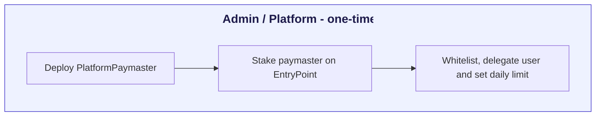
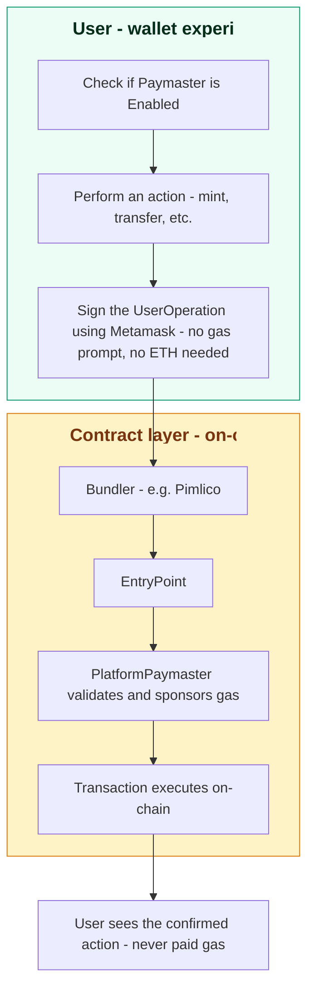

# Pay on Behalf with EIP-7702

:::caution Beta
Pay on Behalf transactions are currently in **beta**. APIs, contract addresses, and behavior may change before the stable release. Use on testnet only and do not rely on this feature in production.
:::

:::info Token Registry v5 only
Pay on Behalf is only supported for **Token Registry v5 (TR v5)** contracts deployed via `TDocDeployer`. It is not available for earlier token registry versions. See the [TR v5 migration guide](../../migration-guide/migration-tr-v5) if you are still on an older registry.
:::

TrustVC supports **Pay on Behalf** — letting a platform (issuer) cover trade document transaction costs for its users. Users can deploy token registries, mint documents, and perform all title escrow operations without holding ETH, while gas is sponsored on their behalf by a **PlatformPaymaster**.

Under the hood, this is implemented as a **gasless** transaction flow using [EIP-7702](https://eips.ethereum.org/EIPS/eip-7702) (smart account delegation) and ERC-4337 account abstraction — the "Pay on Behalf" name describes the outcome for the user (the platform pays), while "gasless" describes the underlying mechanism you'll see referenced in code and function names.

## Architecture

The system is built on three smart contracts:

| Contract                 | Role                                                                                                                                                                                                                             |
| ------------------------ | -------------------------------------------------------------------------------------------------------------------------------------------------------------------------------------------------------------------------------- |
| `EIP7702Implementation`  | Shared smart account logic. EOAs delegate to this once via a type-4 transaction — their bytecode becomes `0xef0100 \|\| impl_address`, giving them full smart-account capability while keeping the same address and private key. |
| `PlatformPaymaster`      | Per-platform ERC-4337 paymaster deployed as a minimal-proxy clone. Sponsors gas for registry deploys, mints, and title escrow operations within configured limits.                                                               |
| `PlatformAccountFactory` | Deploys `PlatformPaymaster` clones deterministically via `CREATE2`. Cheap (~55 k gas) and the clone address is predictable before deployment.                                                                                    |

## How it works

The flow splits into a one-time **admin setup** (done once by the platform) and the **user experience** (repeated for every action the user takes). The user never sees a gas prompt or needs to hold ETH.

<div style={{display: 'flex', justifyContent: 'center'}}>





</div>

In text form, the same flow:

```
User (EOA, no ETH)
  │
  │  1. Sign EIP-7702 authorization → EOA delegates to EIP7702Implementation
  │  2. Submit UserOperation via a bundler
  │
  ▼
Bundler
  │
  │  3. Calls EntryPoint → validates against PlatformPaymaster
  │
  ▼
PlatformPaymaster
  │
  ├── Path A — Title escrow / registry calls
  │     Checks: caller ∈ authorizedCallers, target ∈ authorizedRegistries or authorizedTitleEscrows
  │     Enforces: dailyLimit per user
  │
  └── Path B — deployRegistry / mintDocument on the paymaster itself
        deployRegistry: userWhitelist[sender] > 0 (platform whitelists users)
        mintDocument:   caller has MINTER_ROLE on the registry
```

## Deployed addresses

### Sepolia (chainId: 11155111)

| Contract                           | Address                                      |
| ---------------------------------- | -------------------------------------------- |
| EIP7702Implementation              | `0xa46EC3920Ac5fc54F4bA33185A91ae250aDF59B8` |
| PlatformPaymaster (implementation) | `0xa24695178ea881ab7d4d105106e4906a8da4752b` |
| PlatformAccountFactory             | `0x7e9ef6363180baa744eb32ceab367a44f52adc9f` |
| TDocDeployer                       | `0x64bc665056DC8bE4092e569ED13a7F273Be28cD2` |
| EntryPoint v0.8                    | `0x4337084D9E255Ff0702461CF8895CE9E3b5Ff108` |

### Polygon Amoy (chainId: 80002)

| Contract                           | Address                                      |
| ---------------------------------- | -------------------------------------------- |
| EIP7702Implementation              | `0x044de1d4515a76ed9e431e8ec89e8d600405fd86` |
| PlatformPaymaster (implementation) | `0x1c4367128933E9a88de26C723F50C288fA0fFea7` |
| PlatformAccountFactory             | `0xfbe1d336000d567f98ac5318f7c0144501388409` |
| TDocDeployer                       | `0xfcafea839e576967b96ad1FBFB52b5CA26cd1D25` |
| EntryPoint v0.8                    | `0x4337084D9E255Ff0702461CF8895CE9E3b5Ff108` |

## SDK package

The `@trustvc/trustvc` SDK exposes all Pay on Behalf functions under the `eip7702-functions` namespace. Install it once:

```bash
npm install @trustvc/trustvc@beta
```

Import any function directly:

```ts
import {
  deployTokenRegistryGasless,
  mintGasless,
  transferHolderGasless,
  transferBeneficiaryGasless,
  transferOwnersGasless,
  nominateGasless,
  returnToIssuerGasless,
  rejectReturnedGasless,
  acceptReturnedGasless,
  rejectTransferHolderGasless,
  rejectTransferBeneficiaryGasless,
  rejectTransferOwnersGasless,
} from "@trustvc/trustvc";
```

:::note Naming
These SDK functions keep the `Gasless` suffix (their actual exported names), even though the feature is presented to platforms and end users as **Pay on Behalf**. The suffix refers to the underlying mechanism; the name doesn't change based on which bundler or paymaster infrastructure you use.
:::

## Prerequisites

Before calling any Pay on Behalf function you need:

1. **A PlatformPaymaster deployed for your platform** — see [Setup](./setup).
2. **A bundler/paymaster provider API key** — see [Setup](./setup) for a walkthrough using Pimlico as an example.
3. **The user's EOA delegated** — one-time type-4 transaction (wallet signs an EIP-7702 authorization).
4. **A built `smartAccountClient`** — the permissionless `SmartAccountClient` wrapping the delegated EOA.

All four are covered in [Setup](./setup). Once set up, jump to [Operations](./operations) for code examples. If you're looking for how this is exposed in the TT-web application's Settings page, see [Pay on Behalf on TT-web](./tt-web-settings).

## Disclaimer

Pay on Behalf is one possible way to sponsor a user's transaction costs. This reference implementation uses **EIP-7702 smart account delegation** together with **Pimlico** as an example bundler and paymaster infrastructure provider. Pimlico is referenced here only because it's what this implementation is built and tested against — TrustVC does not require, endorse, or favor Pimlico over any other provider. Any ERC-4337-compatible bundler and paymaster infrastructure that supports EIP-7702 can be substituted.
