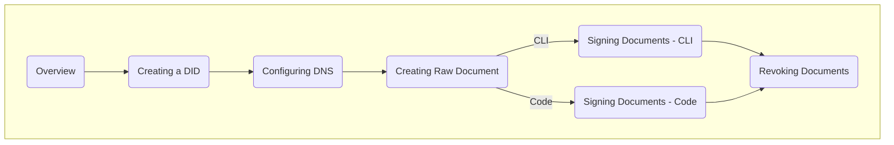

```mermaid
graph TD;
subgraph Z[" "]
direction LR
    A(Overview)-->B(Creating a DID);
    B-->C(Configuring DNS);
    C-->D(Creating Raw Document);
    D -- CLI -->E(Signing Documents - CLI);
    D -- Code -->F(Signing Documents - Code);
    E-->G(Revoking Documents);
    F-->G;

    click A href "/docs/tutorial/verifiable-documents/overview"
    click B href "/docs/tutorial/verifiable-documents/create"
    click C href "/docs/tutorial/verifiable-documents/dns"
    click D href "/docs/tutorial/verifiable-documents/raw-document"
    click G href "/docs/tutorial/verifiable-documents/signing-document/signing-document-cli"
    click H href "/docs/tutorial/verifiable-documents/signing-document/signing-document-code"

    click I href "/docs/tutorial/verifiable-documents/revoking-document"
end
```
