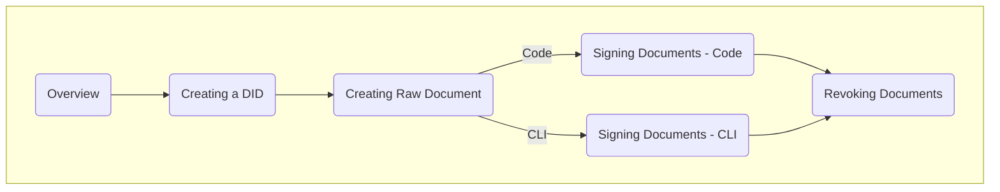

```mermaid
graph TD;
subgraph Z[" "]
direction LR
    A(Overview)-->B(Creating a DID);
    B-->C(Creating Raw Document);
    C -- CLI -->D(Signing Documents - CLI);
    C -- Code -->E(Signing Documents - Code);
    E-->F(Revoking Documents);
    D-->F;

    click A href "docs/key-components-of-tradetrust/w3c-vc/verifying-documents/overview"
    click B href "/docs/key-components-of-tradetrust/w3c-vc/identify-the-issuer/issuer-method-did-web"
    click C href "/docs/key-components-of-tradetrust/w3c-vc/tradetrust-document-schema"
    click D href "/docs/key-components-of-tradetrust/w3c-vc/signing-documents/signing-document-cli"
    click E href "/docs/key-components-of-tradetrust/w3c-vc/signing-documents/signing-document-code"
    click F href "/docs/key-components-of-tradetrust/w3c-vc/verifying-documents/document-status"
    click G href "/docs/tutorial/verifiable-documents/revoking-document"
end
```
