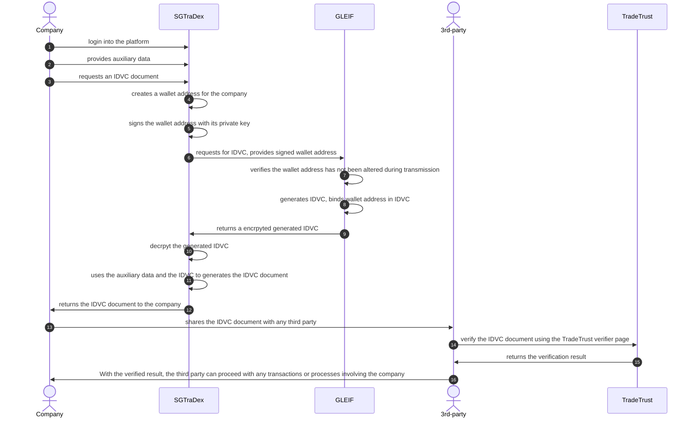

# IDVC Flowchart:

```mermaid
sequenceDiagram
    autonumber
    actor Company
    participant SGTraDex
    participant GLEIF
    actor 3rd-party
    participant TradeTrust
    Company->>SGTraDex: login into the platform
    Company->>SGTraDex: provides auxiliary data
    Company->>SGTraDex: requests an IDVC document
    SGTraDex->>SGTraDex: creates a wallet address for the company
    SGTraDex->>SGTraDex: signs the wallet address with its private key
    SGTraDex->>GLEIF: requests for IDVC, provides signed wallet address
    GLEIF->>GLEIF: verifies the wallet address has not been altered during transmission
    GLEIF->>GLEIF: generates IDVC, binds wallet address in IDVC
    GLEIF->>SGTraDex: returns a encrpyted generated IDVC
    SGTraDex->>SGTraDex: decrpyt the generated IDVC
    SGTraDex->>SGTraDex: uses the auxiliary data and the IDVC to generates the IDVC document
    SGTraDex->>Company: returns the IDVC document to the company
    Company->>3rd-party: shares the IDVC document with any third party
    3rd-party->>TradeTrust: verify the IDVC document using the TradeTrust verifier page
    TradeTrust->>3rd-party: returns the verification result
    3rd-party->>Company: With the verified result, the third party can proceed with any transactions or processes involving the company
```
