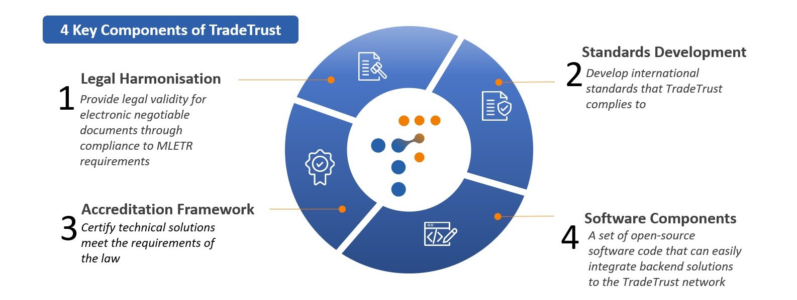
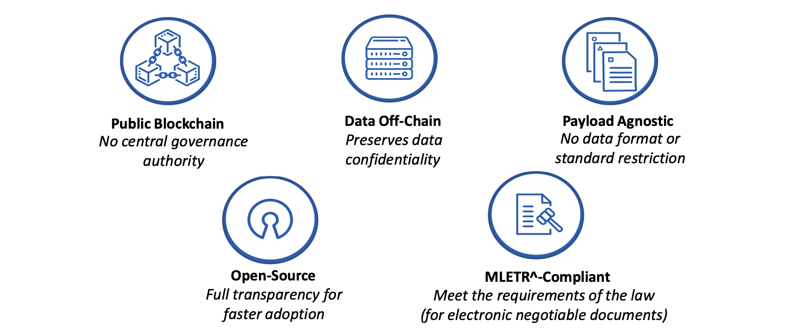

## What is TradeTrust?

TradeTrust is a framework that is built using TrustVC framework as its base by IMDA.

TradeTrust comprises globally-accepted standards such as W3C Verifiable Credentials (VCs) and Decentralised Identifiers (DIDs). In addition to the standards, TradeTrust connects governments and businesses to a public blockchain to enable trusted interoperability of electronic transferable records (ETRs) across digital platforms and it is offered as a digital utility.

### TradeTrust's 3 Key Functionalities: Authenticity, Source & Title Ownership for Trade Documents​

TradeTrust is designed to provide industry the means to verify the authenticity and source of a document, as well as to create Electronic Transferable Records (ETRs) that are functionally equivalent to their paper versions (e.g. able to effect title transfers)

### TradeTrust Design Principles

The technical tutorials will cover the deployment and minting of a TradeTrust document in the context of a Verifiable Document and a Transferable Records.

## Goal

By the end of this guide, you would be able to create your very own Verifiable Documents and Transferable Records that is valid on any compatible TradeTrust Viewer. The following guides are available:

- Use TradeTrust with [Verifiable Documents](/docs/tutorial/verifiable-documents/overview).
- Use TradeTrust with [Transferable Records](/docs/tutorial/transferable-records/overview).

Please keep in mind that before we start, there are a couple of prerequisite to know.
