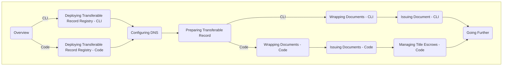

```mermaid
graph TD;
subgraph Z[" "]
direction LR

    A(Overview) -- CLI --> B(Deploying Transferable Record Registry - CLI);
    A -- Code --> C(Deploying Transferable Record Registry - Code);
    B --> D(Configuring DNS);
    C --> D;
    D --> E(Preparing Transferable Record);
    E -- CLI --> F(Wrapping Documents - CLI);
    E -- Code --> G(Wrapping Documents - Code);
    F(Wrapping Documents - CLI) --> H(Issuing Document - CLI);
    G(Wrapping Documents - Code) --> I(Issuing Documents - Code);
    I --> J(Managing Title Escrows - Code);
    H --> K(Going Further);
    J --> K;

    click A href "/docs/tutorial/transferable-records/overview"
    click B href "/docs/tutorial/transferable-records/token-registry/token-registry-cli"
    click C href "/docs/tutorial/transferable-records/token-registry/token-registry-code"
    click D href "/docs/tutorial/transferable-records/dns"
    click E href "/docs/tutorial/transferable-records/raw-document"
    click F href "/docs/tutorial/transferable-records/wrapping-document/wrapping-document-cli"
    click G href "/docs/tutorial/transferable-records/wrapping-document/wrapping-document-code"
    click H href "/docs/tutorial/transferable-records/issuing-document/issuing-document-cli"
    click I href "/docs/tutorial/transferable-records/issuing-document/issuing-document-code"
    click J href "/docs/tutorial/transferable-records/title-escrow/title-escrow-code"
    click K href "/docs/tutorial/transferable-records/going-further"
end
```
