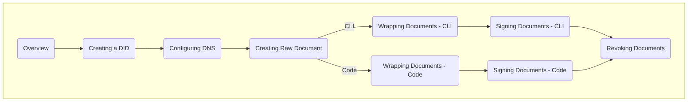

```mermaid
graph TD;
subgraph Z[" "]
direction LR
    A(Overview)-->B(Creating a DID);
    B-->C(Configuring DNS);
    C-->D(Creating Raw Document);
    D -- CLI -->E(Wrapping Documents - CLI);
    D -- Code -->F(Wrapping Documents - Code);
    E-->G(Signing Documents - CLI);
    F-->H(Signing Documents - Code);
    G-->I(Revoking Documents);
    H-->I;

    click A href "/docs/tutorial/verifiable-documents/did/overview"
    click B href "/docs/tutorial/verifiable-documents/did/create"
    click C href "/docs/tutorial/verifiable-documents/did/dns"
    click D href "/docs/tutorial/verifiable-documents/did/raw-document"
    click E href "/docs/tutorial/verifiable-documents/did/wrapping-document/wrapping-document-cli"
    click F href "/docs/tutorial/verifiable-documents/did/wrapping-document/wrapping-document-code"
    click G href "/docs/tutorial/verifiable-documents/did/signing-document/signing-document-cli"
    click H href "/docs/tutorial/verifiable-documents/did/signing-document/signing-document-code"

    click I href "/docs/tutorial/verifiable-documents/did/revoking-document"
end
```
