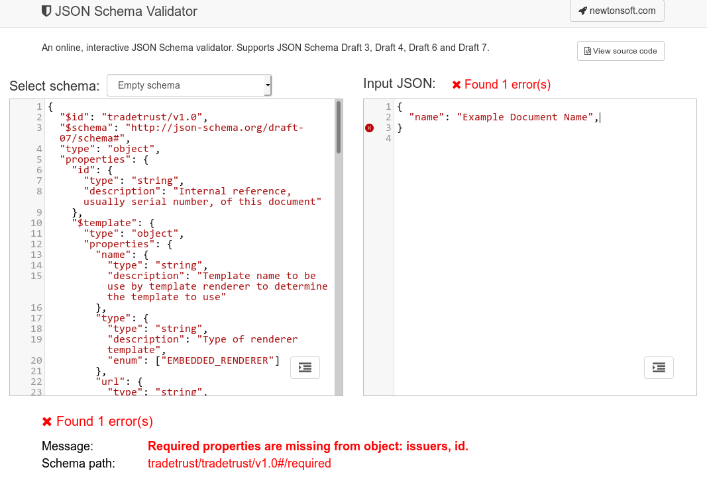

# Creating Custom Documents

The TradeTrust (.tt) file is a `.json` file that conforms to the [OpenAttestation](https://github.com/GovTechSG/open-attestation) specification.

At the root level, each file contains information on the schema type, certificate data, hidden data (from privacy filter) and a signature. Details of the OpenAttestation file format can be found on the [Github page](https://github.com/GovTechSG/open-attestation).

What you will be most concerned with is the document data. All these data are stored in the `data` key on the TradeTrust file and conforms to the [TradeTrust schema](https://github.com/TradeTrust/tradetrust-schema/).

For this section, we will focus on populating the document data that conforms to the schema.

## TradeTrust Schema

The TradeTrust schema is largely free-form, with not many constraints on the fields that have to be present. The only required data pertains to the issuer (you) details as well as name and id of the document.

## Using JSON Schema Validator

An useful online tool to help you understand the JSON schema is the [JSON Schema Validator](https://www.jsonschemavalidator.net/).

Simply paste the content of the schema document on the left panel and you can start writing the document data on the right. The tool will instantly validate the document data shape and will notify you of potential errors.



You can see that the validation failed because of missing properties on JSON Schema Validator

## A Minimal Document

```json
{
  "name": "Example Document Name",
  "id": "2019-12-01-123456",
  "issuers": [
    {
      "name": "Example Issuer",
      "documentStore": "0xF889f82BD860B76ef5cBC5E015d3f1c7bD288707",
      "identityProof": {
        "type": "DNS-TXT",
        "location": "https://example.org"
      }
    }
  ]
}
```

The simplest certificate contains only the values for `id`, `name`, `issuers`.

Try creating a minimal certificate using the tool above to get an idea of what goes into a certificate.

### `id` Field

The `id` field is a string used to uniquely identify the document. In most cases, the serial number of the corresponding physical document can be used.

Alternatively, a random [uuid](https://en.wikipedia.org/wiki/Universally_unique_identifier) can be generated and used here.

### `name` field

The `name` field is a string that refers to the name of the document.

### `issuedOn` field (optional)

The `issuedOn` field is a date-time string conforming to the [ISO 8601, RFC 3339](https://tools.ietf.org/html/rfc3339#section-5.6) format.

Example of a valid `issuedOn` string is `2018-08-31T23:59:32+08:00`. Where it specifies the date-time (HH:MM:SS) 23:59:32, on 31/08/2018, in the timezone GMT +8.

### `issuers` field

The `issuers` is an array of the issuer object. The required fields for each issuer is `name` and one of `documentStore` OR `tokenRegistry`. Other fields such as `did`, `url`, `email` and `phone` are also recognised.

The `name` specifies the name of the issuing body while the `documentStore` specifies the smart contract address of the document store deployed by the issuing body.
Transferrable assets will use a [`tokenRegistry`](./token-registry) in place of a `documentStore`

The `documentStore` address can be obtained after [deploying an instance of the smart contract](./deploying-store).

### `recipient` field (optional)

The `recipient` is an object of the recipient. The only required field is `name` while other properties such as `did`, `url`, `email` and `phone` are available.

## A Complete Document

Once you are done with the minimal document, you can include more data into the document. There are no constraints on unspecified key names in the document object, so you may feel free to structure it however you wish.
This data structure will be coupled to your [custom rendering template](./custom-template), so it may make sense to develop them in combination. 

A common mistake many make is to put presentation elements into the document. This is highly not recommended as it bloats the individual document files with repeated information.

Examples: Font types/sizes, Images, Document backgrounds

### `attachments` field

The attachments field can be used for arbitrary arrays of binary data stored in base64 format, such as `pdf` or `png` or `jpg`. Your custom template should handle these fields as appropriate.


## Saving the Certificate

Once the certificate data has been created/generated, simply export it as a `.json` file. All the certificates will be batched together to be committed onto the blockchain with the [CLI tool](https://github.com/tradetrust/tradetrust-cli) or your custom node.js application using the [npm package](https://www.npmjs.com/package/@govtechsg/open-certificate) later.
