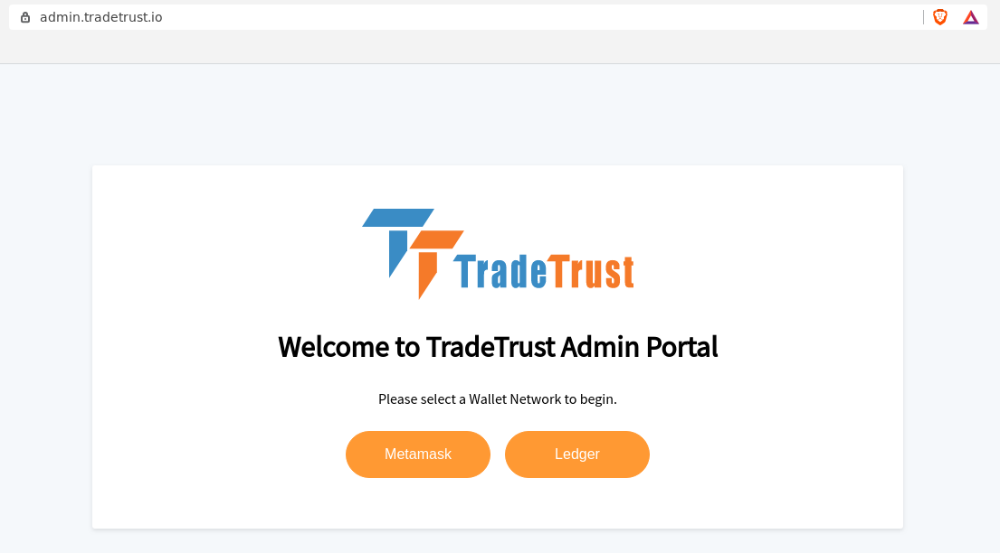
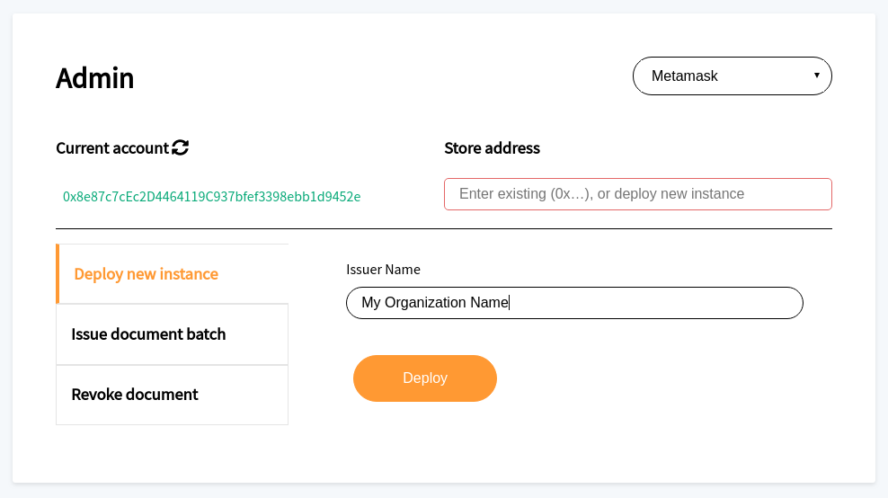
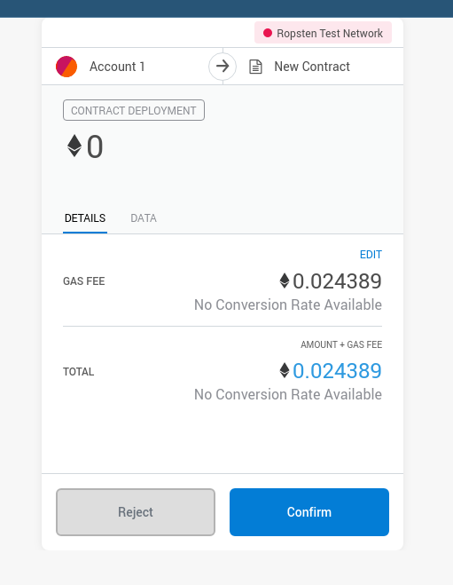
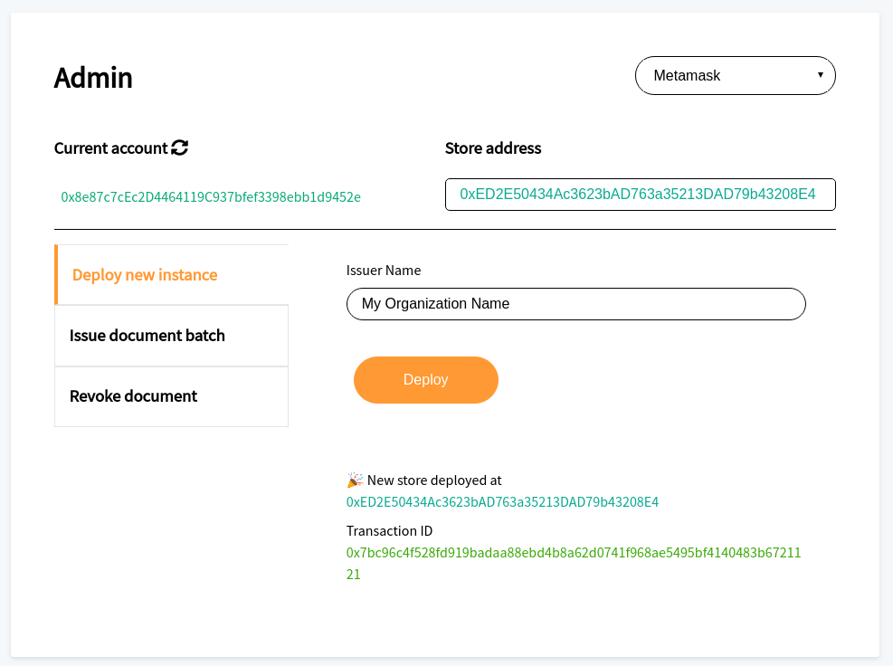

# 🚀 Deploying Document Store Smart Contract

The document store is a smart contract on the Ethereum network that records the issuance and revocation status of TT documents. In this guide, we will deploy a document store smart contract on the Ethereum `ropsten` network, which is a test network that does not require actual ethers for transactions.

### Using the Admin site:

This guide will help you to deploy a document store using the [admin site](https://admin.tradetrust.io).

##### Prerequisites

- Google Chrome Browser
- Metamask setup, refer to the [Test Account Setup Guide](https://openattestation.com/docs/appendix/ropsten-setup) for the setup guide
- Set Metamask Network to `Ropsten`

##### Deploying Store

1. Visit the [admin page](https://admin.tradetrust.io)

1. Select Metamask on the web app to connect it to your Metamask wallet. Click on _Connect_ to allow the web app to interact with Metamask wallet.

1. Enter your organization name as the _Issuer Name_ and click _Deploy_ to deploy the document store as an Ethereum smart contract.

1. After clicking on _Deploy_, you will be asked to confirm the transaction in a separate popup. Click _Confirm_ to continue.

##### Successful Deploy

Once your document store smart contract has been successfully deployed, you will see the success message with the document store address.

In the example above, the document store address is `0xED2E50434Ac3623bAD763a35213DAD79b43208E4`, please do NOT use the Transaction ID.

*Save the document store address somewhere as the web app does not keep track of your document store addresses.*

Stay tuned for some upcoming tooling improvements for deploying stores, documentation will be updated then.
