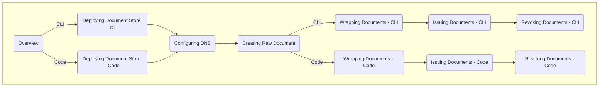

```mermaid
graph TD;
subgraph Z[" "]
direction LR
    A(Overview)-- CLI -->B(Deploying Document Store - CLI);
    A(Overview)-- Code -->C(Deploying Document Store - Code);
    B-->D(Configuring DNS);
    C-->D(Configuring DNS);
    D-->E(Creating Raw Document)
    E -- CLI -->F(Wrapping Documents - CLI);
    E -- Code -->G(Wrapping Documents - Code);
    F-->H(Issuing Documents - CLI);
    G-->I(Issuing Documents - Code);
    H-->J(Revoking Documents - CLI);
    I-->K(Revoking Documents - Code);

    click A href "/docs/tutorial/verifiable-documents/advanced/document-store/overview"
    click B href "/docs/tutorial/verifiable-documents/advanced/document-store/deploying-document-store/document-store-cli"
    click C href "/docs/tutorial/verifiable-documents/advanced/document-store/deploying-document-store/document-store-code"
    click D href "/docs/tutorial/verifiable-documents/advanced/document-store/configuring-dns"
    click E href "/docs/tutorial/verifiable-documents/advanced/document-store/raw-document"
    click F href "/docs/tutorial/verifiable-documents/advanced/document-store/wrapping-document/wrapping-document-cli"
    click G href "/docs/tutorial/verifiable-documents/advanced/document-store/wrapping-document/wrapping-document-code"
    click H href "/docs/tutorial/verifiable-documents/advanced/document-store/issuing-document/issuing-document-cli"
    click I href "/docs/tutorial/verifiable-documents/advanced/document-store/issuing-document/issuing-document-code"
    click J href "/docs/tutorial/verifiable-documents/advanced/document-store/revoking-document/revoking-document-cli"
    click K href "/docs/tutorial/verifiable-documents/advanced/document-store/revoking-document/revoking-document-code"
end
```
